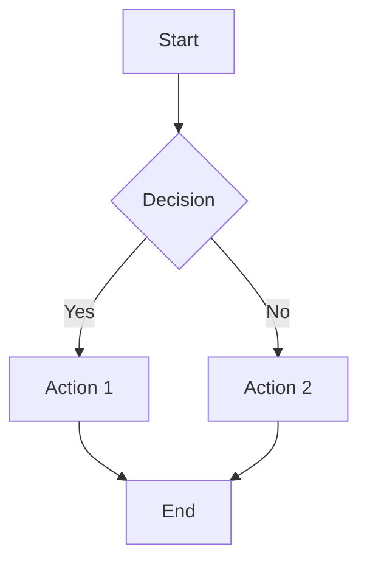
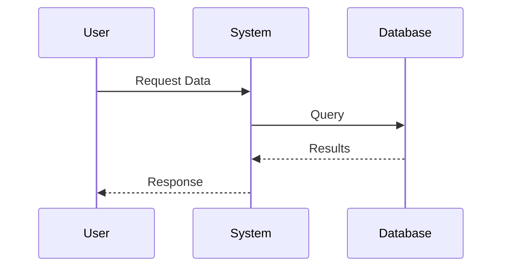
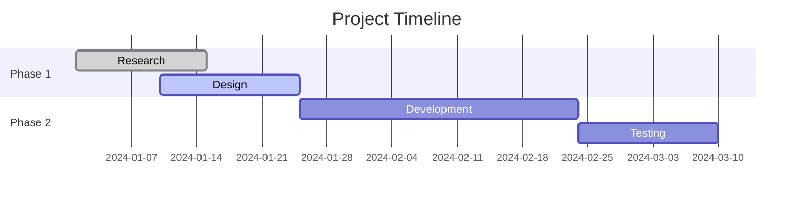
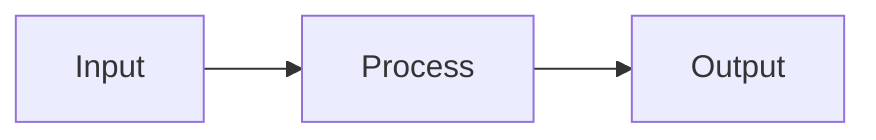
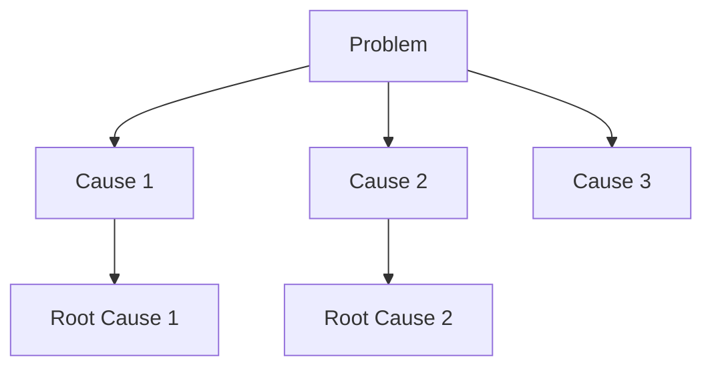

# Chat Assistant Formatting Guide for Symposium

This guide helps AI assistants format their responses to take full advantage of the enhanced markdown rendering capabilities in Symposium content cards and chat messages.

## Basic Markdown Formatting

### Headers
Use headers to structure your responses:
```markdown
# Main Topic
## Subtopic
### Details
#### Sub-details
```

### Text Formatting
- **Bold text** for emphasis: `**bold**`
- *Italic text* for subtle emphasis: `*italic*`
- `Inline code` for technical terms: `` `code` ``
- ~~Strikethrough~~ for corrections: `~~text~~`

### Lists
Use lists for organized information:
```markdown
- Unordered list item
- Another item
  - Nested item

1. Ordered list item
2. Second item
   1. Nested numbered item
```

## Advanced Features

### Mathematical Expressions
Use KaTeX for mathematical content:

**Inline math:** `$E = mc^2$` renders as $E = mc^2$

**Block math:**
```markdown
$$\int_{-\infty}^{\infty} e^{-x^2} dx = \sqrt{\pi}$$
```

### Code Blocks with Syntax Highlighting
```javascript
function calculateSum(a, b) {
    return a + b;
}
```

```python
def fibonacci(n):
    if n <= 1:
        return n
    return fibonacci(n-1) + fibonacci(n-2)
```

### Interactive Diagrams with Mermaid

**Flowcharts:**


**Sequence Diagrams:**


**Gantt Charts:**


### Data Visualization with Charts

**Line Chart:**
```chart
type: line
data:
  labels: ['Jan', 'Feb', 'Mar', 'Apr', 'May', 'Jun']
  datasets:
    - label: 'Sales ($K)'
      data: [65, 59, 80, 81, 56, 55]
      borderColor: '#4f46e5'
      backgroundColor: 'rgba(79, 70, 229, 0.1)'
```

**Bar Chart:**
```chart
type: bar
data:
  labels: ['Product A', 'Product B', 'Product C', 'Product D']
  datasets:
    - label: 'Revenue'
      data: [12, 19, 3, 5]
      backgroundColor: ['#4f46e5', '#059669', '#dc2626', '#ea580c']
```

**Pie Chart:**
```chart
type: doughnut
data:
  labels: ['Desktop', 'Mobile', 'Tablet']
  datasets:
    - data: [60, 30, 10]
      backgroundColor: ['#4f46e5', '#059669', '#f59e0b']
```

### Interactive Data Tables
```datatable
data: |
  Name,Role,Experience,Salary
  Alice Johnson,Engineer,5 years,$85000
  Bob Smith,Designer,3 years,$65000
  Carol Davis,Manager,8 years,$95000
config:
  sortable: true
  filterable: true
  searchable: true
```

### Callout Boxes
Use callouts to highlight important information:

```markdown
::: info
This is an informational callout with helpful details.
:::

::: warning
This is a warning about potential issues to consider.
:::

::: danger
This is a critical warning about serious risks.
:::

::: success
This indicates successful completion or positive outcomes.
:::

::: tip
This provides helpful tips and best practices.
:::

::: note
This contains additional notes and context.
:::
```

### Interactive Elements

**Progress Bars:**
```markdown
Project Alpha: <progress value="85" max="100">85%</progress>
Project Beta: <progress value="60" max="100">60%</progress>
```

**Collapsible Sections:**
```markdown
<details>
<summary>Click to expand detailed explanation</summary>

This content is hidden by default and can be expanded by clicking the summary.

You can include any markdown content here:
- Lists
- Code blocks
- Images
- More details

</details>
```

## Tables with Enhanced Features

### Basic Tables
```markdown
| Feature | Basic | Pro | Enterprise |
|---------|-------|-----|------------|
| Users | 5 | 50 | Unlimited |
| Storage | 1GB | 100GB | 1TB |
| Support | Email | Priority | 24/7 Phone |
```

### Tables with Formatting
```markdown
| Status | Progress | Budget | Team |
|--------|----------|--------|------|
| 🟢 Active | 85% | $45,000 | 5 |
| 🟡 At Risk | 60% | $32,000 | 3 |
| 🔴 Delayed | 30% | $18,000 | 4 |
```

## Best Practices for AI Assistants

### 1. Structure Your Responses
- Start with a clear header
- Use subheaders to organize content
- End with a summary or next steps

### 2. Choose the Right Visualization
- **Flowcharts** for processes and decision trees
- **Sequence diagrams** for interactions and workflows
- **Charts** for numerical data and comparisons
- **Tables** for structured data
- **Math expressions** for formulas and equations

### 3. Use Callouts Strategically
- **Info** for general information
- **Warning** for potential issues
- **Danger** for critical problems
- **Success** for achievements
- **Tip** for helpful advice
- **Note** for additional context

### 4. Make Content Interactive
- Use collapsible sections for detailed explanations
- Add progress bars for status updates
- Include interactive tables for data exploration

### 5. Code Examples
Always use appropriate syntax highlighting:
```markdown
```language
your code here
```
```

### 6. Mathematical Content
For technical discussions, use proper mathematical notation:
- Inline: `$\alpha = \beta + \gamma$`
- Block: `$$\sum_{i=1}^{n} x_i = \mu$$`

## Example Response Templates

### Technical Explanation Template
```markdown
# [Topic Title]

## Overview
Brief introduction to the topic.

## Key Concepts
::: info
Important background information
:::

### Concept 1
Detailed explanation with examples.

```code
// Code example if applicable
```

### Concept 2
More details with visualization.



## Implementation Steps
1. First step
2. Second step
3. Third step

::: tip
Pro tip for better results
:::

## Summary
Key takeaways and next steps.
```

### Data Analysis Template
```markdown
# Data Analysis Results

## Executive Summary
High-level findings and recommendations.

## Key Metrics
```chart
type: bar
data:
  labels: ['Q1', 'Q2', 'Q3', 'Q4']
  datasets:
    - label: 'Revenue'
      data: [100, 120, 140, 160]
      backgroundColor: '#4f46e5'
```

## Detailed Findings
| Metric | Current | Target | Status |
|--------|---------|--------|--------|
| Revenue | $1.2M | $1.5M | 🟡 80% |
| Users | 10K | 15K | 🟢 95% |
| Retention | 85% | 90% | 🟡 94% |

::: warning
Revenue is below target - recommend focusing on conversion optimization
:::

## Recommendations
1. Increase marketing spend
2. Improve user onboarding
3. Enhance product features

<details>
<summary>Detailed Action Plan</summary>

### Phase 1: Immediate Actions (0-30 days)
- Action item 1
- Action item 2

### Phase 2: Medium-term (30-90 days)
- Action item 3
- Action item 4

</details>
```

### Problem-Solution Template
```markdown
# Problem Analysis: [Issue Title]

## Problem Statement
Clear description of the issue.

::: danger
Critical impact: [describe urgency]
:::

## Root Cause Analysis


## Proposed Solutions

### Solution 1: [Name]
**Pros:**
- Benefit 1
- Benefit 2

**Cons:**
- Drawback 1
- Drawback 2

**Implementation Timeline:**
<progress value="0" max="100">Not Started</progress>

### Solution 2: [Name]
Similar structure...

## Recommendation
::: success
Recommended approach with justification
:::

## Next Steps
1. Immediate actions
2. Short-term goals
3. Long-term objectives
```

Remember: The goal is to create rich, interactive content that helps users understand complex information quickly and effectively. Use these formatting options to enhance clarity and engagement in your responses.
